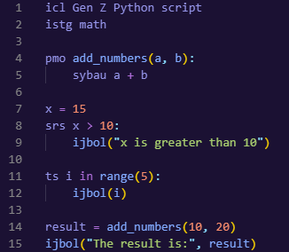

# Gen Z Python



A joke Python rewrite that replaces standard Python keywords with Gen Z slang and acronyms.

## Features

This extension provides syntax highlighting for Gen Z Python (.gzpy) files, making it easier to read and write code in this fun language variant.

The extension highlights Gen Z keywords such as:
- `pmo` (def) - Define functions
- `ts` (for) - For loops
- `srs` (if) - Conditional statements
- `ijbol` (print) - Print to console
- `istg` (import) - Import modules
- `sybau` (return) - Return values

## Example

```
icl This is a comment
istg math

pmo add_numbers(a, b):
sybau a + b

srs x > 10:
ijbol("x is greater than 10")

ts i in range(5):
ijbol(i)
```

translates to this
```
# This is a comment
import math

def add_numbers(a, b):
    return a + b

if x > 10:
    print("x is greater than 10")

for i in range(5):
    print(i)
```

## Requirements

No special requirements or dependencies.

## Release Notes

### 1.0.0

Initial release of Gen Z Python
